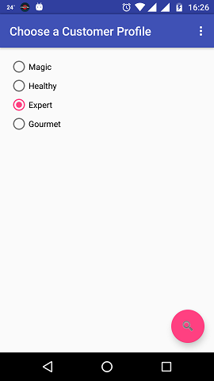
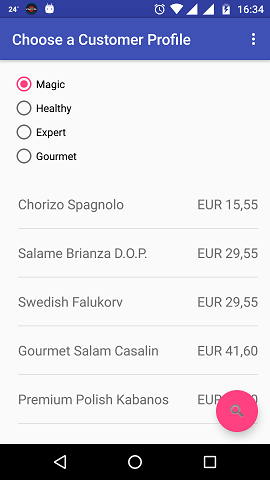
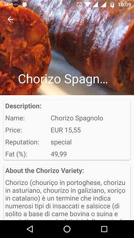
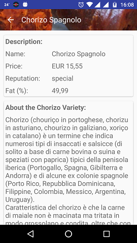
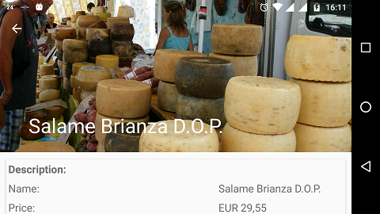

# Prosciutto-Mob 

This [post](https://rafaelfiume.com/2013/04/07/dragons-unicorns-and-titans-an-agile-software-developer-tail/) explains what this app is for.

Select a customer profile to see a list of suggested products for him/her. 

  

Click in one of the listed products to know more about it. 

   

Images and the content in the "About Variety" section are retrieved from Wikipedia.  
 
 

## Most Interesting Things Happening Here...

* Written in Kotlin :)
* It consumes a [microservice](https://github.com/rafaelfiume/Salume) deployed into Heroku
* A few end-to-end black-box tests, specially: 
[AdviserEndToEndHappyPathTest](https://github.com/rafaelfiume/Prosciutto-Mob/blob/master/app/src/androidTest/kotlin/com/rafaelfiume/prosciutto/adviser/test/AdviserEndToEndHappyPathTest.kt) and [ShowAdvisedProductDetailsTest](https://github.com/rafaelfiume/Prosciutto-Mob/blob/master/app/src/androidTest/kotlin/com/rafaelfiume/prosciutto/adviser/test/ShowAdvisedProductDetailsActivityTest.kt)
* The use of CollapsingToolbarLayout in the product details view.

## User Stories

### Request <a href="http://rafaelfiume.github.io/Salume/com/rafaelfiume/salume/acceptance/adviser/AdviseProductBasedOnCustomerProfileEndToEndTest.html" target="blank">Advice Based on Customer Profile</a> (Parent Story)
* ~~Request advice happy path~~
* ~~Request advice sad path~~
* ~~Improve UI displaying product details when clicking on an item in the list~~
* ~~Improve UI displaying a illustrative picture of the product in the Details View~~
* ~~Show a picture and description of the product according to the product variety~~ 

Todo: Consider to use fragments to compose the view and [Dagger](http://google.github.io/dagger/) for dependency injection. 

## Running the App

The following environment variable must be set:
* $SUPPLIER_STAGING_URL when running the app in staging mode.

Most commonly used command-line tasks are:

    $./gradlew connectedDevDebugAndroidTest
    $./gradlew testDevDebugUnitTest
    $./gradlew assembleDebug
    $./gradlew assembleRelease
    $./gradlew tasks
    $./gradlew test --continue
