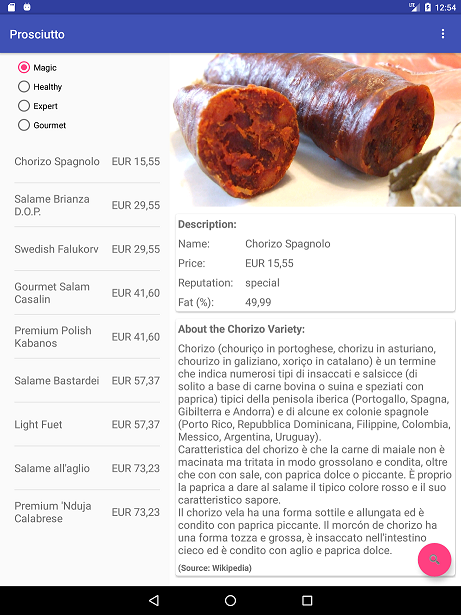

# Prosciutto-Mob  

This [post](https://rafaelfiume.com/2013/04/07/dragons-unicorns-and-titans-an-agile-software-developer-tail/) explains what this app is for.

Select a customer profile to see a list of suggested products for him/her. 

  

Click in one of the listed products to know more about it. 

   

Two pane layout when in large screens.
 
 
 
(Source of images and content in the 'About' section: [Wikipedia](https://en.wikipedia.org/wiki/Wikipedia:Contributing_to_Wikipedia) )

## A Few Other Interesting Things Happening Here...

* Written in Kotlin :)
* It consumes a [microservice](https://github.com/rafaelfiume/Salume) deployed into Heroku
* A few acceptance tests, specially: 
[AdviserEndToEndHappyPathTest](https://github.com/rafaelfiume/Prosciutto-Mob/blob/master/app/src/androidTest/kotlin/com/rafaelfiume/prosciutto/adviser/test/AdviserEndToEndHappyPathTest.kt) and [ShowAdvisedProductDetailsTest](https://github.com/rafaelfiume/Prosciutto-Mob/blob/master/app/src/androidTest/kotlin/com/rafaelfiume/prosciutto/adviser/test/ShowAdvisedProductDetailsActivityTest.kt)
* The use of CollapsingToolbarLayout in the product details view.

## Running the App

The following environment variable must be set:
* $SUPPLIER_STAGING_URL when running the app in staging mode.

Most commonly used command-line tasks are:

    λ → gradlew connectedDevDebugAndroidTest -PdisablePreDex
    λ → gradlew testDevDebugUnitTest --continue
    λ → gradlew :test-support:test
    λ → gradlew assembleDebug
    λ → gradlew assembleRelease
    λ → gradlew tasks
